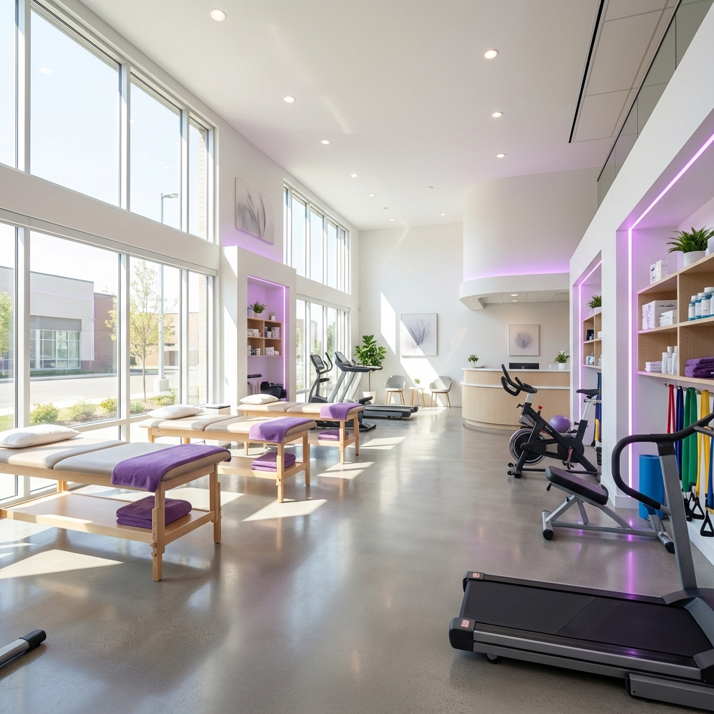

# 🌟 Dra. Gleyce - Fisioterapia Premium

Site moderno e responsivo para fisioterapeuta, desenvolvido com HTML, CSS e JavaScript puro.



## 🎨 Características

- **Design Premium** com tema roxo elegante
- **Totalmente Responsivo** (Mobile, Tablet, Desktop)
- **Animações Suaves** com AOS (Animate On Scroll)
- **SEO Otimizado** com meta tags e estrutura semântica
- **Acessibilidade** seguindo padrões WCAG
- **Performance** otimizada com lazy loading

## 📋 Seções

1. **Hero** - Apresentação impactante com call-to-action
2. **Sobre** - Perfil profissional e credenciais
3. **Especialidades** - Áreas de atuação
4. **Tratamentos** - Técnicas e procedimentos oferecidos
5. **Diferenciais** - Por que escolher o atendimento
6. **Depoimentos** - Feedback de pacientes
7. **Blog** - Artigos e dicas de saúde
8. **Contato** - Formulário e informações de contato
9. **Footer** - Links e redes sociais

## 🚀 Recursos Modernos

- ✅ Botão flutuante do WhatsApp com animação pulse
- ✅ Banner de cookies (LGPD compliant)
- ✅ Botão "Voltar ao topo"
- ✅ Menu mobile hamburger
- ✅ Smooth scroll entre seções
- ✅ Formulário de contato integrado com WhatsApp
- ✅ Lazy loading de imagens

## 🛠️ Tecnologias Utilizadas

- **HTML5** - Estrutura semântica
- **CSS3** - Design system com variáveis CSS
- **JavaScript** - Interatividade e funcionalidades
- **AOS Library** - Animações on scroll
- **Google Fonts** - Tipografia (Inter & Outfit)

## 📱 Responsividade

O site é totalmente responsivo e otimizado para:

- 📱 **Mobile** - Smartphones (< 768px)
- 📱 **Tablet** - Tablets (768px - 1024px)
- 💻 **Desktop** - Desktops e laptops (> 1024px)

## 🎨 Paleta de Cores

```css
--purple-primary: #7C3AED   /* Roxo vibrante */
--purple-dark: #5B21B6      /* Roxo escuro */
--purple-light: #A78BFA     /* Roxo claro */
--purple-pastel: #DDD6FE    /* Roxo pastel */
--purple-bg: #F3E8FF        /* Background roxo */
```

## 📂 Estrutura de Arquivos

```
drgleyce-theme/
├── index.html              # Página principal
├── style.css               # Estilos CSS
├── script.js               # JavaScript
├── favicon.png             # Ícone do site
├── assets/
│   ├── images/
│   │   ├── hero-bg.jpg     # Imagem do hero
│   │   └── profile.jpg     # Foto de perfil
│   └── icons/              # Ícones SVG
└── README.md               # Este arquivo
```

## 🚀 Como Usar

### Visualização Local

1. Clone ou baixe este repositório
2. Abra o arquivo `index.html` em seu navegador
3. Pronto! O site está funcionando localmente

### Personalização

#### Alterar Informações de Contato

Edite o arquivo `index.html` e `script.js` e substitua:
- `5511999999999` pelo número de WhatsApp real
- `contato@dragleyce.com.br` pelo e-mail real
- Endereço e horários de atendimento

#### Alterar Cores

Edite o arquivo `style.css` na seção de variáveis CSS (`:root`):

```css
:root {
  --purple-primary: #SUA_COR_AQUI;
  /* ... outras variáveis ... */
}
```

#### Alterar Imagens

Substitua os arquivos em `assets/images/`:
- `hero-bg.jpg` - Imagem de fundo do hero
- `profile.jpg` - Foto de perfil profissional

#### Alterar Textos

Todos os textos estão no arquivo `index.html` e podem ser editados diretamente.

## 🌐 Deploy no GitHub Pages

1. Crie um repositório no GitHub
2. Faça upload de todos os arquivos
3. Vá em **Settings** > **Pages**
4. Em **Source**, selecione a branch `main` e pasta `/ (root)`
5. Clique em **Save**
6. Seu site estará disponível em: `https://seu-usuario.github.io/drgleyce-theme/`

## 📊 SEO

O site já vem otimizado para SEO com:

- Meta tags descritivas
- Open Graph tags para redes sociais
- Estrutura semântica HTML5
- Heading hierarchy correta
- Alt texts em imagens
- URLs amigáveis

## ♿ Acessibilidade

- Estrutura semântica HTML5
- ARIA labels em elementos interativos
- Contraste de cores WCAG AAA
- Navegação por teclado
- Alt texts descritivos

## 📄 Licença

Este projeto é de uso livre para fins pessoais e comerciais.

## 👩‍💻 Suporte

Para dúvidas ou suporte, entre em contato através do WhatsApp ou e-mail disponíveis no site.

---

**Desenvolvido com ❤️ para Dra. Gleyce**

© 2025 Dra. Gleyce - Fisioterapia. Todos os direitos reservados.
